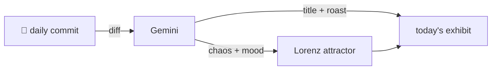

### Hey 👋

I'm Urav. I build things with code.

---

#### 📌 Featured Commit

Every day a bot grabs a commit (one of mine, someone I follow, or a stranger's), an AI names and roasts it, and it ends up as a strange attractor.

<!-- ENTROPY:START -->

### The Conductor's Dashboard

Chaos ████████░░ 85 · Mood $\color{#1E4287}{\blacksquare}$ #1E4287

[affaan-m/ECC](https://github.com/affaan-m/ECC) by [@affaan-m](https://github.com/affaan-m) · [`bc8e12b`](https://github.com/affaan-m/ECC/commit/bc8e12bb80c904a5a9864797ef1fd1212aa82f3d)

~~~
feat: add dynamic workflow team orchestration surface

Adds dynamic workflow/team orchestration skills, the content pack, and control-pane work-item/Kanban state DB support. Includes reviewer hardening for state-db CLI validation, optional state DB f
…
~~~

This isn't merely a feature; it's a declaration of war on solo agent silos. A new Kanban-style control pane for agents, backed by a fresh state database, moves ECC firmly into orchestrating AI *teams*. While "optional state DB failure handling" sounds like a polite warning for impending production issues, the strategic depth of the accompanying content pack is undeniably ambitious.

captured 2026-06-05

<!-- ENTROPY:END -->

---

What is this?

 

A GitHub Action runs daily and picks a commit: mine if I've pushed recently, otherwise something from my network or a starred repo, and the Linux genesis commit as a last resort. Gemini gives it a name, a roast, a chaos score (0-100), and a mood color. Those become a [Lorenz attractor](https://en.wikipedia.org/wiki/Lorenz_system): chaos controls how wild the butterfly gets, mood tints the gradient, and the commit hash sets the starting point. The math is identical every run, so the commit is the only thing that changes the picture.

[See the code →](./entropy)

