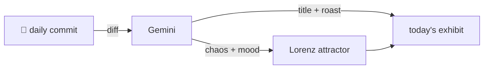

### Hey 👋

I'm Urav. I build things with code.

---

#### 📌 Featured Commit

Every day a bot grabs a commit (one of mine, someone I follow, or a stranger's), an AI names and roasts it, and it ends up as a strange attractor.

<!-- ENTROPY:START -->

### Editor: Felt Impressions

Chaos ███░░░░░░░ 35 · Mood $\color{#2c3e50}{\blacksquare}$ #2c3e50

[urav06/ship-of-theseus](https://github.com/urav06/ship-of-theseus) by [@urav06](https://github.com/urav06) · [`651cf5b`](https://github.com/urav06/ship-of-theseus/commit/651cf5b0c1e823c3efe956ef5afce25f4d31b60d)

~~~
settle the vscode editor feel
~~~

This isn't merely 'settling the feel,' it's a meticulously crafted philosophy manifested in `settings.json`. The aggressive debloating, the precise Markdown whitespace handling, and the nuanced Git blame decoration show a developer who has truly mastered their environment. A beautiful testament to focused, distraction-free work.

captured 2026-09-09

<!-- ENTROPY:END -->

---

What is this?

 

A GitHub Action runs daily and picks a commit: mine if I've pushed recently, otherwise something from my network or a starred repo, and the Linux genesis commit as a last resort. Gemini gives it a name, a roast, a chaos score (0-100), and a mood color. Those become a [Lorenz attractor](https://en.wikipedia.org/wiki/Lorenz_system): chaos controls how wild the butterfly gets, mood tints the gradient, and the commit hash sets the starting point. The math is identical every run, so the commit is the only thing that changes the picture.

[See the code →](./entropy)

