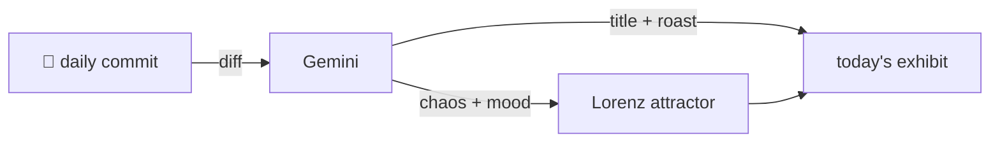

### Hey 👋

I'm Urav. I build things with code.

---

#### 📌 Featured Commit

Every day a bot grabs a commit (one of mine, someone I follow, or a stranger's), an AI names and roasts it, and it ends up as a strange attractor.

<!-- ENTROPY:START -->

### The Purging Pivot

Chaos ████████░░ 80 · Mood $\color{#306D5E}{\blacksquare}$ #306D5E

[urav06/claudestrophobic](https://github.com/urav06/claudestrophobic) by [@urav06](https://github.com/urav06) · [`e49244b`](https://github.com/urav06/claudestrophobic/commit/e49244bf25b4290a61ea139297751766d9ed2e9e)

~~~
feat: chat + project management over a shared CLI core

Rewrite the plugin around one stdlib engine (cli/store.py) behind two thin
skill faces:

  /sessions  list, delete (by UUID prefix), prune, and browse chats in the
…
~~~

This isn't just adding new features; it's a necessary architectural facelift. Consolidating core cleanup logic into a single Python engine is a sharp move, correcting the previous ad-hoc script spaghetti. The new project-level 'nuke' option, with its focus on atomic operations and real CWD tracking, brings long-overdue control to Claude's digital sprawl, even if Max Spevack’s influence suggests previous shortcomings.

captured 2026-06-03

<!-- ENTROPY:END -->

---

What is this?

 

A GitHub Action runs daily and picks a commit: mine if I've pushed recently, otherwise something from my network or a starred repo, and the Linux genesis commit as a last resort. Gemini gives it a name, a roast, a chaos score (0-100), and a mood color. Those become a [Lorenz attractor](https://en.wikipedia.org/wiki/Lorenz_system): chaos controls how wild the butterfly gets, mood tints the gradient, and the commit hash sets the starting point. The math is identical every run, so the commit is the only thing that changes the picture.

[See the code →](./entropy)

