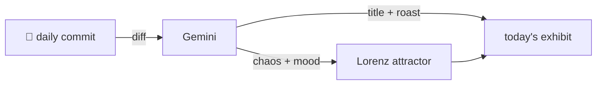

### Hey 👋

I'm Urav. I build things with code.

---

#### 📌 Featured Commit

Every day a bot grabs a commit (one of mine, someone I follow, or a stranger's), an AI names and roasts it, and it ends up as a strange attractor.

<!-- ENTROPY:START -->

### Yarn's Interrogation Mark

Chaos ████░░░░░░ 45 · Mood $\color{#5bc0be}{\blacksquare}$ #5bc0be

[affaan-m/ECC](https://github.com/affaan-m/ECC) by [@thejesh23](https://github.com/thejesh23) · [`5deee34`](https://github.com/affaan-m/ECC/commit/5deee34c93395045b985e3baf91550e5f1ab7204)

~~~
fix(hooks): remove stray '?' that made every 'yarn <anything>' fire tmux reminder (#2517)

* fix(hooks): remove stray '?' that made every 'yarn <anything>' trigger tmux reminder

The tmux-reminder matcher uses one alternation per package manager. Eac
…
~~~

A single question mark turning an intended specific reminder into a spamming nag for nearly every yarn command—that's a classic regex booby trap. The fix itself is surgical, but the sheer volume of meticulous regression tests and subsequent code quality improvements, driven by thoughtful review, elevates this from a simple bugfix to a commendable lesson in engineering rigor.

captured 2026-07-22

<!-- ENTROPY:END -->

---

What is this?

 

A GitHub Action runs daily and picks a commit: mine if I've pushed recently, otherwise something from my network or a starred repo, and the Linux genesis commit as a last resort. Gemini gives it a name, a roast, a chaos score (0-100), and a mood color. Those become a [Lorenz attractor](https://en.wikipedia.org/wiki/Lorenz_system): chaos controls how wild the butterfly gets, mood tints the gradient, and the commit hash sets the starting point. The math is identical every run, so the commit is the only thing that changes the picture.

[See the code →](./entropy)

