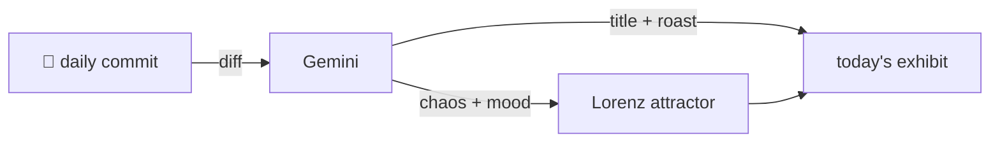

### Hey 👋

I'm Urav. I build things with code.

---

#### 📌 Featured Commit

Every day a bot grabs a commit (one of mine, someone I follow, or a stranger's), an AI names and roasts it, and it ends up as a strange attractor.

<!-- ENTROPY:START -->

### The Hard Truths

Chaos ███░░░░░░░ 35 · Mood $\color{#1F4068}{\blacksquare}$ #1F4068

[murtazahr/Kafila](https://github.com/murtazahr/Kafila) by [@murtazahr](https://github.com/murtazahr) · [`368d478`](https://github.com/murtazahr/Kafila/commit/368d478a9ff186606d0ae1f2b267212a5953ba9e)

~~~
Merge pull request #8 from murtazahr/docs/contributing-security

docs: fix licence rendering, and make CONTRIBUTING and SECURITY ours
~~~

This isn't just doc cleanup; it's a project claiming its identity. The brutal honesty in the SECURITY.md, openly detailing the unauthenticated cluster transport and its implications, is genuinely refreshing and rarely seen. Combined with the exacting contributor guidelines, this sets a strong, opinionated, and realistic tone for a research platform.

captured 2026-08-17

<!-- ENTROPY:END -->

---

What is this?

 

A GitHub Action runs daily and picks a commit: mine if I've pushed recently, otherwise something from my network or a starred repo, and the Linux genesis commit as a last resort. Gemini gives it a name, a roast, a chaos score (0-100), and a mood color. Those become a [Lorenz attractor](https://en.wikipedia.org/wiki/Lorenz_system): chaos controls how wild the butterfly gets, mood tints the gradient, and the commit hash sets the starting point. The math is identical every run, so the commit is the only thing that changes the picture.

[See the code →](./entropy)

