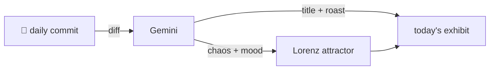

### Hey 👋

I'm Urav. I build things with code.

---

#### 📌 Featured Commit

Every day a bot grabs a commit (one of mine, someone I follow, or a stranger's), an AI names and roasts it, and it ends up as a strange attractor.

<!-- ENTROPY:START -->

### Refined Integrations

Chaos ███████░░░ 75 · Mood $\color{#475B6F}{\blacksquare}$ #475B6F

[srbhr/Resume-Matcher](https://github.com/srbhr/Resume-Matcher) by [@srbhr](https://github.com/srbhr) · [`116f9cc`](https://github.com/srbhr/Resume-Matcher/commit/116f9cc3b00e1ac91734a6c2679bf41ea64a0edc)

~~~
Merge pull request #907 from srbhr/dev

Release: autosave, CJK fonts, tailor feedback + full code-review remediation
~~~

This release is a deep dive into complex, interconnected issues. From wire-level LLM provider nuances and vital PII scrubbing to international font support and robust config validation, it is an impressive showcase of defence-in-depth and meticulous bug squashing. It clears out many latent landmines.

captured 2026-08-12

<!-- ENTROPY:END -->

---

What is this?

 

A GitHub Action runs daily and picks a commit: mine if I've pushed recently, otherwise something from my network or a starred repo, and the Linux genesis commit as a last resort. Gemini gives it a name, a roast, a chaos score (0-100), and a mood color. Those become a [Lorenz attractor](https://en.wikipedia.org/wiki/Lorenz_system): chaos controls how wild the butterfly gets, mood tints the gradient, and the commit hash sets the starting point. The math is identical every run, so the commit is the only thing that changes the picture.

[See the code →](./entropy)

