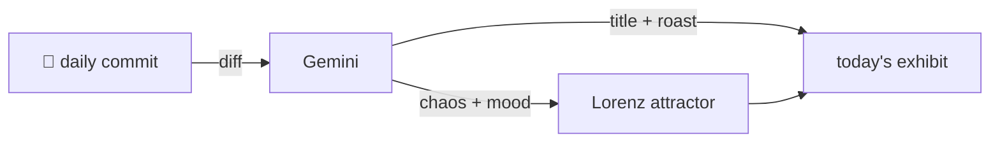

### Hey 👋

I'm Urav. I build things with code.

---

#### 📌 Featured Commit

Every day a bot grabs a commit (one of mine, someone I follow, or a stranger's), an AI names and roasts it, and it ends up as a strange attractor.

<!-- ENTROPY:START -->

### Gitleaks Guardian, Claude's Leash

Chaos █████░░░░░ 55 · Mood $\color{#20354A}{\blacksquare}$ #20354A

[urav06/ship-of-theseus](https://github.com/urav06/ship-of-theseus) by [@urav06](https://github.com/urav06) · [`352b688`](https://github.com/urav06/ship-of-theseus/commit/352b68892eb900b8dd58a2e21b3054218717182f)

~~~
commit hook and claude permissions update
~~~

Installing gitleaks pre-commit is an absolute must-have in this era; preventing secrets from ever landing in history is the only true way. Granting Claude a controlled, explicit leash to `.gitignore` shows a healthy distrust of automation. A smart, protective move.

captured 2026-09-03

<!-- ENTROPY:END -->

---

What is this?

 

A GitHub Action runs daily and picks a commit: mine if I've pushed recently, otherwise something from my network or a starred repo, and the Linux genesis commit as a last resort. Gemini gives it a name, a roast, a chaos score (0-100), and a mood color. Those become a [Lorenz attractor](https://en.wikipedia.org/wiki/Lorenz_system): chaos controls how wild the butterfly gets, mood tints the gradient, and the commit hash sets the starting point. The math is identical every run, so the commit is the only thing that changes the picture.

[See the code →](./entropy)

