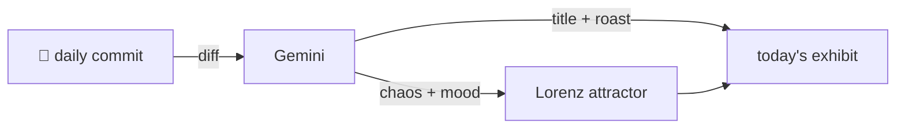

### Hey 👋

I'm Urav. I build things with code.

---

#### 📌 Featured Commit

Every day a bot grabs a commit (one of mine, someone I follow, or a stranger's), an AI names and roasts it, and it ends up as a strange attractor.

<!-- ENTROPY:START -->

### Checklist Retired, Scope Defined

Chaos █░░░░░░░░░ 15 · Mood $\color{#36454F}{\blacksquare}$ #36454F

[rid-saw/latent](https://github.com/rid-saw/latent) by [@rid-saw](https://github.com/rid-saw) · [`29c8950`](https://github.com/rid-saw/latent/commit/29c8950c8c3b4e0feeab791f8210a6eaa9aa6c84)

~~~
docs: drop dev checklist from README, fold connector scope into Idea
~~~

Ah, the old 'delete the dev checklist' maneuver. Often a sign of either maturity and moved goals, or sheer fatigue with maintaining bullet points. Integrating the job listings connector into the main feature list just makes it look tidier. It's a documentation facelift, making things seem more stable than they likely are under the hood.

captured 2026-07-27

<!-- ENTROPY:END -->

---

What is this?

 

A GitHub Action runs daily and picks a commit: mine if I've pushed recently, otherwise something from my network or a starred repo, and the Linux genesis commit as a last resort. Gemini gives it a name, a roast, a chaos score (0-100), and a mood color. Those become a [Lorenz attractor](https://en.wikipedia.org/wiki/Lorenz_system): chaos controls how wild the butterfly gets, mood tints the gradient, and the commit hash sets the starting point. The math is identical every run, so the commit is the only thing that changes the picture.

[See the code →](./entropy)

