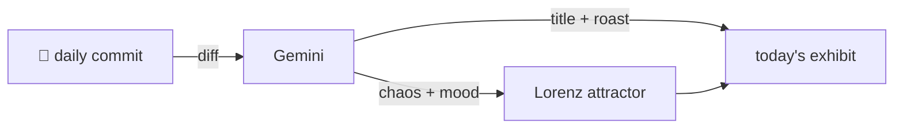

### Hey 👋

I'm Urav. I build things with code.

---

#### 📌 Featured Commit

Every day a bot grabs a commit (one of mine, someone I follow, or a stranger's), an AI names and roasts it, and it ends up as a strange attractor.

<!-- ENTROPY:START -->

### Azure Foundry Spotlight

Chaos ░░░░░░░░░░ 5 · Mood $\color{#0078D4}{\blacksquare}$ #0078D4

[microsoft/VibeVoice](https://github.com/microsoft/VibeVoice) by [@pengzhiliang](https://github.com/pengzhiliang) · [`94da20d`](https://github.com/microsoft/VibeVoice/commit/94da20d98b2fa7688e9cbfaf7692ddb4954f7600)

~~~
Merge pull request #423 from sd983527/patch-1

Update news section in README.md
~~~

Another feather in the cap, straight into the Azure platform. Someone actually sorted this chronologically instead of blindly appending, a small victory for ordered documentation.

captured 2026-07-25

<!-- ENTROPY:END -->

---

What is this?

 

A GitHub Action runs daily and picks a commit: mine if I've pushed recently, otherwise something from my network or a starred repo, and the Linux genesis commit as a last resort. Gemini gives it a name, a roast, a chaos score (0-100), and a mood color. Those become a [Lorenz attractor](https://en.wikipedia.org/wiki/Lorenz_system): chaos controls how wild the butterfly gets, mood tints the gradient, and the commit hash sets the starting point. The math is identical every run, so the commit is the only thing that changes the picture.

[See the code →](./entropy)

