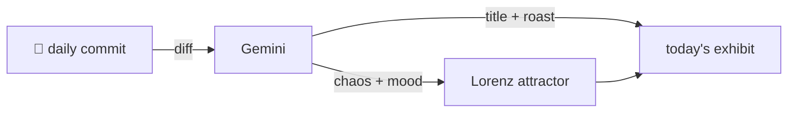

### Hey 👋

I'm Urav. I build things with code.

---

#### 📌 Featured Commit

Every day a bot grabs a commit (one of mine, someone I follow, or a stranger's), an AI names and roasts it, and it ends up as a strange attractor.

<!-- ENTROPY:START -->

### Meta-AI Mends

Chaos ██████░░░░ 65 · Mood $\color{#007FFF}{\blacksquare}$ #007FFF

[affaan-m/ECC](https://github.com/affaan-m/ECC) by [@affaan-m](https://github.com/affaan-m) · [`4092795`](https://github.com/affaan-m/ECC/commit/40927950c49f6e742d341e20ff7b9b7e1e7bfff5)

~~~
fix: community-reported issues — pyproject URLs, dashboard Tkinter error, 1.x→2.0 migration guide, cyber-safeguards docs (#2481)

* fix: repo URLs in pyproject, graceful dashboard tkinter error, 1.x->2.0 migration guide, cyber-safeguards troubleshoot
…
~~~

A crucial clean-up effort following a painful identity crisis, expertly documented and robustly coded. Graceful error handling for Tkinter and pragmatic advice on upstream AI model safeguards prevent countless user headaches. It seems the spectral presence of Devin AI is earning its bytes, quietly stabilizing things after a big repo rename.

captured 2026-07-10

<!-- ENTROPY:END -->

---

What is this?

 

A GitHub Action runs daily and picks a commit: mine if I've pushed recently, otherwise something from my network or a starred repo, and the Linux genesis commit as a last resort. Gemini gives it a name, a roast, a chaos score (0-100), and a mood color. Those become a [Lorenz attractor](https://en.wikipedia.org/wiki/Lorenz_system): chaos controls how wild the butterfly gets, mood tints the gradient, and the commit hash sets the starting point. The math is identical every run, so the commit is the only thing that changes the picture.

[See the code →](./entropy)

