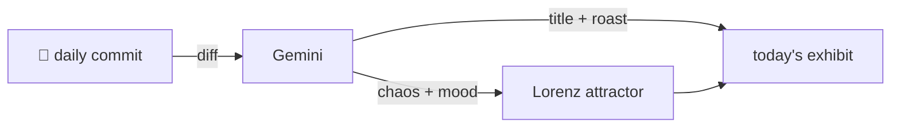

### Hey 👋

I'm Urav. I build things with code.

---

#### 📌 Featured Commit

Every day a bot grabs a commit (one of mine, someone I follow, or a stranger's), an AI names and roasts it, and it ends up as a strange attractor.

<!-- ENTROPY:START -->

### Invisible Text, Visible Speed

Chaos ██████░░░░ 65 · Mood $\color{#70C1B4}{\blacksquare}$ #70C1B4

[palmier-io/palmier-pro](https://github.com/palmier-io/palmier-pro) by [@htin1](https://github.com/htin1) · [`5280b86`](https://github.com/palmier-io/palmier-pro/commit/5280b8661ff1ce71bfc994f93a8ab938fc656af7)

~~~
[perf] Skip AVComposition rebuilds for caption-only edits (#485)

* [perf] Skip AVComposition rebuilds for caption-only edits

The rebuild cache keyed on the whole timeline, so every caption edit
missed and triggered a full async CompositionBuilder.b
…
~~~

This is a remarkably thorough and elegant performance fix for a very common workflow bottleneck. Re-architecting the rebuild cache key to disregard cosmetic text-only changes, while still accounting for text's influence on total duration, shows impressive attention to detail. Moving a ~470ms hit to ~6ms is a huge win for user experience and product responsiveness.

captured 2026-08-04

<!-- ENTROPY:END -->

---

What is this?

 

A GitHub Action runs daily and picks a commit: mine if I've pushed recently, otherwise something from my network or a starred repo, and the Linux genesis commit as a last resort. Gemini gives it a name, a roast, a chaos score (0-100), and a mood color. Those become a [Lorenz attractor](https://en.wikipedia.org/wiki/Lorenz_system): chaos controls how wild the butterfly gets, mood tints the gradient, and the commit hash sets the starting point. The math is identical every run, so the commit is the only thing that changes the picture.

[See the code →](./entropy)

