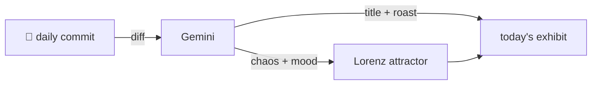

### Hey 👋

I'm Urav. I build things with code.

---

#### 📌 Featured Commit

Every day a bot grabs a commit (one of mine, someone I follow, or a stranger's), an AI names and roasts it, and it ends up as a strange attractor.

<!-- ENTROPY:START -->

### The Symlink Pilgrimage

Chaos ██████░░░░ 65 · Mood $\color{#FFA07A}{\blacksquare}$ #FFA07A

[dualeai/seek](https://github.com/dualeai/seek) by [@clemlesne](https://github.com/clemlesne) · [`ef063c5`](https://github.com/dualeai/seek/commit/ef063c58e24c4a81733f66e1b762b1de09b7862b)

~~~
Merge branch 'develop'
~~~

About bloody time. Expecting users to babysit `lstat` behavior and jump through hoops for symlinks is a relic from a crueler era. Switching to `stat` is a sensible default for path operands and the exhaustive testing demonstrates this was done with due care. Now, users can just… use the tool as they expect.

captured 2026-06-14

<!-- ENTROPY:END -->

---

What is this?

 

A GitHub Action runs daily and picks a commit: mine if I've pushed recently, otherwise something from my network or a starred repo, and the Linux genesis commit as a last resort. Gemini gives it a name, a roast, a chaos score (0-100), and a mood color. Those become a [Lorenz attractor](https://en.wikipedia.org/wiki/Lorenz_system): chaos controls how wild the butterfly gets, mood tints the gradient, and the commit hash sets the starting point. The math is identical every run, so the commit is the only thing that changes the picture.

[See the code →](./entropy)

