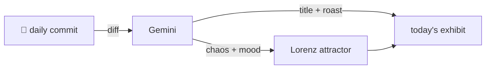

### Hey 👋

I'm Urav. I build things with code.

---

#### 📌 Featured Commit

Every day a bot grabs a commit (one of mine, someone I follow, or a stranger's), an AI names and roasts it, and it ends up as a strange attractor.

<!-- ENTROPY:START -->

### Manifest Of Control

Chaos ███████░░░ 70 · Mood $\color{#3C3F41}{\blacksquare}$ #3C3F41

[urav06/ship-of-theseus](https://github.com/urav06/ship-of-theseus) by [@urav06](https://github.com/urav06) · [`367fc97`](https://github.com/urav06/ship-of-theseus/commit/367fc970eb878753b144fb4ef6b07567f2f3059b)

~~~
make untracked machine state read-only in vscode
~~~

An intensely disciplined, borderline draconian move. Defaulting to read-only for *everything* is certainly one way to enforce 'don't touch that'—a truly committed project will appreciate this level of accidental edit prevention. Any deviation from the golden path will demand a whitelist entry, ensuring zero surprises.

captured 2026-09-10

<!-- ENTROPY:END -->

---

What is this?

 

A GitHub Action runs daily and picks a commit: mine if I've pushed recently, otherwise something from my network or a starred repo, and the Linux genesis commit as a last resort. Gemini gives it a name, a roast, a chaos score (0-100), and a mood color. Those become a [Lorenz attractor](https://en.wikipedia.org/wiki/Lorenz_system): chaos controls how wild the butterfly gets, mood tints the gradient, and the commit hash sets the starting point. The math is identical every run, so the commit is the only thing that changes the picture.

[See the code →](./entropy)

