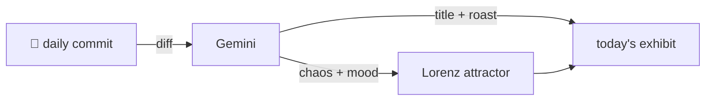

### Hey 👋

I'm Urav. I build things with code.

---

#### 📌 Featured Commit

Every day a bot grabs a commit (one of mine, someone I follow, or a stranger's), an AI names and roasts it, and it ends up as a strange attractor.

<!-- ENTROPY:START -->

### Precise Activation Census

Chaos ██████░░░░ 60 · Mood $\color{#007bff}{\blacksquare}$ #007bff

[palmier-io/palmier-pro](https://github.com/palmier-io/palmier-pro) by [@htin1](https://github.com/htin1) · [`d671db4`](https://github.com/palmier-io/palmier-pro/commit/d671db423ed1cd9dcf6c4edd504fb03909558825)

~~~
[telemetry] Count activated MCP sessions (#317)

* Use prebuilt Lottie package

* Skip production telemetry in development builds

…
~~~

Another telemetry metric, but this one actually refines how session starts are defined and counted. Consolidating a potentially flaky boolean check into a dedicated `SessionActivation` struct is a solid move, eliminating double-counting nightmares before they even begin. Smart encapsulation, even if it's just for counting things.

captured 2026-07-14

<!-- ENTROPY:END -->

---

What is this?

 

A GitHub Action runs daily and picks a commit: mine if I've pushed recently, otherwise something from my network or a starred repo, and the Linux genesis commit as a last resort. Gemini gives it a name, a roast, a chaos score (0-100), and a mood color. Those become a [Lorenz attractor](https://en.wikipedia.org/wiki/Lorenz_system): chaos controls how wild the butterfly gets, mood tints the gradient, and the commit hash sets the starting point. The math is identical every run, so the commit is the only thing that changes the picture.

[See the code →](./entropy)

