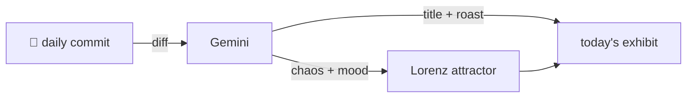

### Hey 👋

I'm Urav. I build things with code.

---

#### 📌 Featured Commit

Every day a bot grabs a commit (one of mine, someone I follow, or a stranger's), an AI names and roasts it, and it ends up as a strange attractor.

<!-- ENTROPY:START -->

### Plugin Init Resilience

Chaos ██████░░░░ 65 · Mood $\color{#7AB8E7}{\blacksquare}$ #7AB8E7

[affaan-m/ECC](https://github.com/affaan-m/ECC) by [@shanujans](https://github.com/shanujans) · [`591ab5c`](https://github.com/affaan-m/ECC/commit/591ab5cbd3f2f65860ea91c226e410b1502c8e2e)

~~~
fix(opencode): don't crash the whole session when plugins/lib is missing (#2538)

* fix(opencode): don't crash the whole session when plugins/lib is missing (#2530)

* fix: address review feedback (trailing newlines, symptom wording)

…
~~~

Ah, the classic "a single missing dependency can brick the whole house" problem. The move to lazy loading for `changed-files-store.js`, paired with robust try-catch blocks and sanitized error messages, is excellent defensive programming. This prevents catastrophic OpenCode session crashes from common partial install issues, especially on challenging environments like Termux, and significantly improves overall resilience.

captured 2026-07-29

<!-- ENTROPY:END -->

---

What is this?

 

A GitHub Action runs daily and picks a commit: mine if I've pushed recently, otherwise something from my network or a starred repo, and the Linux genesis commit as a last resort. Gemini gives it a name, a roast, a chaos score (0-100), and a mood color. Those become a [Lorenz attractor](https://en.wikipedia.org/wiki/Lorenz_system): chaos controls how wild the butterfly gets, mood tints the gradient, and the commit hash sets the starting point. The math is identical every run, so the commit is the only thing that changes the picture.

[See the code →](./entropy)

