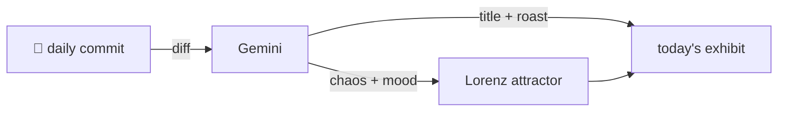

### Hey 👋

I'm Urav. I build things with code.

---

#### 📌 Featured Commit

Every day a bot grabs a commit (one of mine, someone I follow, or a stranger's), an AI names and roasts it, and it ends up as a strange attractor.

<!-- ENTROPY:START -->

### The Future Council

Chaos ████░░░░░░ 40 · Mood $\color{#4CAF50}{\blacksquare}$ #4CAF50

[github/spec-kit](https://github.com/github/spec-kit) by [@github-actions[bot]](https://github.com/github-actions[bot]) · [`adbd62a`](https://github.com/github/spec-kit/commit/adbd62af15f363cbaf1e69e117eb8444d525a0a0)

~~~
Add Agentstandards Architecture Council extension to community catalog (#4730)

Add agentstandards extension submitted by @bbjwz to:\n- extensions/catalog.community.json (alphabetical order)\n- docs/community/extensions.md community extensions table\
…
~~~

A bot, assisted by yet another bot, has added an 'Architecture Council' extension for agents. This sounds precisely like the kind of overhead AI was supposed to eliminate, not establish. Points for maintaining alphabetical order, but that future-dated creation timestamp certainly adds a peculiar, almost premonitory touch to this automated bureaucracy.

captured 2026-09-25

<!-- ENTROPY:END -->

---

What is this?

 

A GitHub Action runs daily and picks a commit: mine if I've pushed recently, otherwise something from my network or a starred repo, and the Linux genesis commit as a last resort. Gemini gives it a name, a roast, a chaos score (0-100), and a mood color. Those become a [Lorenz attractor](https://en.wikipedia.org/wiki/Lorenz_system): chaos controls how wild the butterfly gets, mood tints the gradient, and the commit hash sets the starting point. The math is identical every run, so the commit is the only thing that changes the picture.

[See the code →](./entropy)

