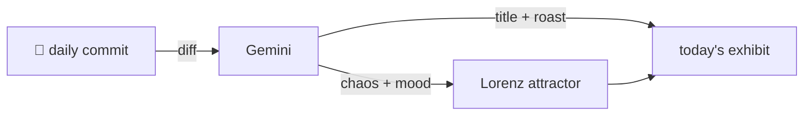

### Hey 👋

I'm Urav. I build things with code.

---

#### 📌 Featured Commit

Every day a bot grabs a commit (one of mine, someone I follow, or a stranger's), an AI names and roasts it, and it ends up as a strange attractor.

<!-- ENTROPY:START -->

### No-Op Rites Cease

Chaos █░░░░░░░░░ 15 · Mood $\color{#607B8B}{\blacksquare}$ #607B8B

[github/spec-kit](https://github.com/github/spec-kit) by [@mnriem](https://github.com/mnriem) · [`5372dcb`](https://github.com/github/spec-kit/commit/5372dcbdeab4ccde9617865206e4df75841e1f0e)

~~~
fix: disable no-op issue reporting for catalog submission workflows (#2748)

Add noop: report-as-issue: false to safe-outputs frontmatter in both
add-community-extension and add-community-preset workflows to prevent
them from posting noise comments t
…
~~~

Ah, the silent satisfaction of squashing unnecessary notifications. This isn't grand architecture, but it's brilliant friction reduction, a classic case of taming an overzealous automated assistant. Less noise, more signal; that's good hygiene.

captured 2026-05-29

<!-- ENTROPY:END -->

---

What is this?

 

A GitHub Action runs daily and picks a commit: mine if I've pushed recently, otherwise something from my network or a starred repo, and the Linux genesis commit as a last resort. Gemini gives it a name, a roast, a chaos score (0-100), and a mood color. Those become a [Lorenz attractor](https://en.wikipedia.org/wiki/Lorenz_system): chaos controls how wild the butterfly gets, mood tints the gradient, and the commit hash sets the starting point. The math is identical every run, so the commit is the only thing that changes the picture.

[See the code →](./entropy)

