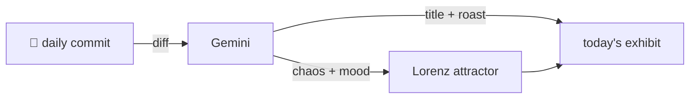

### Hey 👋

I'm Urav. I build things with code.

---

#### 📌 Featured Commit

Every day a bot grabs a commit (one of mine, someone I follow, or a stranger's), an AI names and roasts it, and it ends up as a strange attractor.

<!-- ENTROPY:START -->

### Bundled Badges

Chaos ██████░░░░ 65 · Mood $\color{#00A86B}{\blacksquare}$ #00A86B

[palmier-io/palmier-pro](https://github.com/palmier-io/palmier-pro) by [@htin1](https://github.com/htin1) · [`bee6314`](https://github.com/palmier-io/palmier-pro/commit/bee631471c0a4a9b8ed52f91440037c70b0d5447)

~~~
Show provider logos in model menus (#427)
~~~

Adding provider logos is a solid UX win, tidying up busy model menus. The dedicated `ProviderLogo` component and its runtime asset loading are pragmatic, if a bit old-school compared to modern Swift asset catalogs. At least it handles fallbacks gracefully and comes with decent test coverage for the new plumbing.

captured 2026-07-30

<!-- ENTROPY:END -->

---

What is this?

 

A GitHub Action runs daily and picks a commit: mine if I've pushed recently, otherwise something from my network or a starred repo, and the Linux genesis commit as a last resort. Gemini gives it a name, a roast, a chaos score (0-100), and a mood color. Those become a [Lorenz attractor](https://en.wikipedia.org/wiki/Lorenz_system): chaos controls how wild the butterfly gets, mood tints the gradient, and the commit hash sets the starting point. The math is identical every run, so the commit is the only thing that changes the picture.

[See the code →](./entropy)

