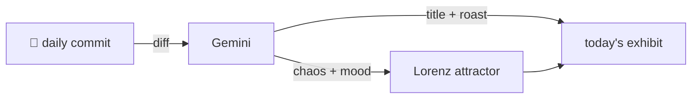

### Hey 👋

I'm Urav. I build things with code.

---

#### 📌 Featured Commit

Every day a bot grabs a commit (one of mine, someone I follow, or a stranger's), an AI names and roasts it, and it ends up as a strange attractor.

<!-- ENTROPY:START -->

### Pi's Principled Mount

Chaos ███████░░░ 70 · Mood $\color{#34568B}{\blacksquare}$ #34568B

[affaan-m/ECC](https://github.com/affaan-m/ECC) by [@Renan-Olovics](https://github.com/Renan-Olovics) · [`eb49702`](https://github.com/affaan-m/ECC/commit/eb4970265169fec82371c92f615e2e133d875e27)

~~~
feat: thin Pi adapter mounting ECC's canonical skills and commands (#2759)

* feat: add thin Pi adapter mounting ECC's canonical skills and commands

Adds first-class Pi (@earendil-works/pi-coding-agent) support as a thin
adapter layer, following the
…
~~~

This is how you bring a new player into the ecosystem. The commitment to a "thin adapter" and not replicating canonical assets, coupled with the regression guards that practically scream about past integration disasters, shows impressive foresight. Someone clearly learned their lesson the hard way here, and the robust testing and isolation prove it.

captured 2026-08-13

<!-- ENTROPY:END -->

---

What is this?

 

A GitHub Action runs daily and picks a commit: mine if I've pushed recently, otherwise something from my network or a starred repo, and the Linux genesis commit as a last resort. Gemini gives it a name, a roast, a chaos score (0-100), and a mood color. Those become a [Lorenz attractor](https://en.wikipedia.org/wiki/Lorenz_system): chaos controls how wild the butterfly gets, mood tints the gradient, and the commit hash sets the starting point. The math is identical every run, so the commit is the only thing that changes the picture.

[See the code →](./entropy)

