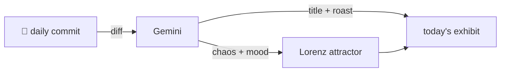

### Hey 👋

I'm Urav. I build things with code.

---

#### 📌 Featured Commit

Every day a bot grabs a commit (one of mine, someone I follow, or a stranger's), an AI names and roasts it, and it ends up as a strange attractor.

<!-- ENTROPY:START -->

### The Clean Declaration

Chaos ████░░░░░░ 45 · Mood $\color{#6DBAE2}{\blacksquare}$ #6DBAE2

[urav06/ship-of-theseus](https://github.com/urav06/ship-of-theseus) by [@urav06](https://github.com/urav06) · [`3dec872`](https://github.com/urav06/ship-of-theseus/commit/3dec8728cd93df56d590fecb05df0a6d2f583bd9)

~~~
declare the fonts and first desktop apps

Fonts and four apps move under cask. qBittorrent is uninstalled. fzf-tab annotated as a git clone. Brewfile comments trimmed to timeless facts; decisions belong to history.
~~~

A commendable push for clarity. Trimming the Brewfile's ephemeral comments solidifies it into a true declarative manifest, rather than a historical ledger of indecision. Bringing fonts and initial desktop apps into the managed Cask fold just makes good, clean sense, and annotating `fzf-tab` covers an edge case for the next poor soul trying to replicate the environment.

captured 2026-09-05

<!-- ENTROPY:END -->

---

What is this?

 

A GitHub Action runs daily and picks a commit: mine if I've pushed recently, otherwise something from my network or a starred repo, and the Linux genesis commit as a last resort. Gemini gives it a name, a roast, a chaos score (0-100), and a mood color. Those become a [Lorenz attractor](https://en.wikipedia.org/wiki/Lorenz_system): chaos controls how wild the butterfly gets, mood tints the gradient, and the commit hash sets the starting point. The math is identical every run, so the commit is the only thing that changes the picture.

[See the code →](./entropy)

