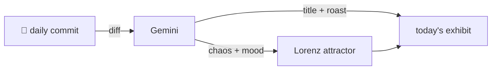

### Hey 👋

I'm Urav. I build things with code.

---

#### 📌 Featured Commit

Every day a bot grabs a commit (one of mine, someone I follow, or a stranger's), an AI names and roasts it, and it ends up as a strange attractor.

<!-- ENTROPY:START -->

### AI Flag Purge

Chaos ███████░░░ 75 · Mood $\color{#4682B4}{\blacksquare}$ #4682B4

[github/spec-kit](https://github.com/github/spec-kit) by [@Copilot](https://github.com/Copilot) · [`7106858`](https://github.com/github/spec-kit/commit/7106858c4e636098815fffa23f6c6b99eb0e156b)

~~~
feat!: remove legacy --ai, --ai-commands-dir, and --ai-skills flags (0.10.0) (#2872)

* Initial plan

* feat!: remove legacy --ai, --ai-commands-dir, and --ai-skills flags at 0.10.0

…
~~~

A necessary but brutal purge of old flag aliases and associated cruft. This wasn't just ripping off a band-aid; it was a surgical removal of an entire limb. While the chaos score is high, it reflects a decisive move towards a cleaner, `--integration`-based future. Good riddance to deprecation warnings!

captured 2026-06-06

<!-- ENTROPY:END -->

---

What is this?

 

A GitHub Action runs daily and picks a commit: mine if I've pushed recently, otherwise something from my network or a starred repo, and the Linux genesis commit as a last resort. Gemini gives it a name, a roast, a chaos score (0-100), and a mood color. Those become a [Lorenz attractor](https://en.wikipedia.org/wiki/Lorenz_system): chaos controls how wild the butterfly gets, mood tints the gradient, and the commit hash sets the starting point. The math is identical every run, so the commit is the only thing that changes the picture.

[See the code →](./entropy)

