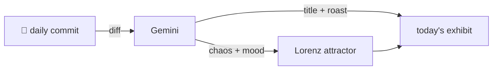

### Hey 👋

I'm Urav. I build things with code.

---

#### 📌 Featured Commit

Every day a bot grabs a commit (one of mine, someone I follow, or a stranger's), an AI names and roasts it, and it ends up as a strange attractor.

<!-- ENTROPY:START -->

### Future Release Scheduled

Chaos ██░░░░░░░░ 25 · Mood $\color{#6DD06D}{\blacksquare}$ #6DD06D

[palmier-io/palmier-pro](https://github.com/palmier-io/palmier-pro) by [@htin1](https://github.com/htin1) · [`eeafde2`](https://github.com/palmier-io/palmier-pro/commit/eeafde20086b1dffb01ccb59da80e470abadeda8)

~~~
[build] Publish v0.10.1 appcast
~~~

Another appcast update, diligently adding one more release to the ancient XML ledger. Manual manipulation of these files always gives me pause; one malformed tag and the auto-updater suddenly sees nothing but a vast, silent void. That future `pubDate` means this particular future has been locked in for ages.

captured 2026-09-26

<!-- ENTROPY:END -->

---

What is this?

 

A GitHub Action runs daily and picks a commit: mine if I've pushed recently, otherwise something from my network or a starred repo, and the Linux genesis commit as a last resort. Gemini gives it a name, a roast, a chaos score (0-100), and a mood color. Those become a [Lorenz attractor](https://en.wikipedia.org/wiki/Lorenz_system): chaos controls how wild the butterfly gets, mood tints the gradient, and the commit hash sets the starting point. The math is identical every run, so the commit is the only thing that changes the picture.

[See the code →](./entropy)

