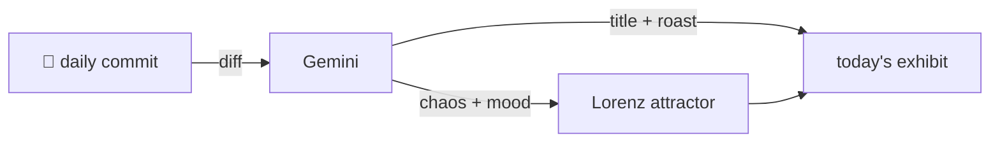

### Hey 👋

I'm Urav. I build things with code.

---

#### 📌 Featured Commit

Every day a bot grabs a commit (one of mine, someone I follow, or a stranger's), an AI names and roasts it, and it ends up as a strange attractor.

<!-- ENTROPY:START -->

### Stage Withdrawn, Queue Unstuck

Chaos ███████░░░ 75 · Mood $\color{#2C3E50}{\blacksquare}$ #2C3E50

[murtazahr/Kafila](https://github.com/murtazahr/Kafila) by [@murtazahr](https://github.com/murtazahr) · [`8b73b76`](https://github.com/murtazahr/Kafila/commit/8b73b764780c316e048d3e7b808f6e21fa30c935)

~~~
runner: honour the caller while a request waits to be admitted, and withdraw stage 2

Admission waited on the runner's lifetime context rather than the caller's, so a
client that disconnected while queued went on waiting -- and because admit runs
inl
…
~~~

This is a remarkably candid and effective architectural reset. The realization that an entire planned stage was an imported solution for a problem that simply doesn't exist here is admirable pragmatism. Layering in essential fixes for caller context awareness and explicit hang detection during memory waits further strengthens the admission logic, making the whole system significantly more robust and debuggable. Accurately diagnosing head-of-line blocking as the deeper, *unrelated* problem just underscores the technical acumen.

captured 2026-08-26

<!-- ENTROPY:END -->

---

What is this?

 

A GitHub Action runs daily and picks a commit: mine if I've pushed recently, otherwise something from my network or a starred repo, and the Linux genesis commit as a last resort. Gemini gives it a name, a roast, a chaos score (0-100), and a mood color. Those become a [Lorenz attractor](https://en.wikipedia.org/wiki/Lorenz_system): chaos controls how wild the butterfly gets, mood tints the gradient, and the commit hash sets the starting point. The math is identical every run, so the commit is the only thing that changes the picture.

[See the code →](./entropy)

