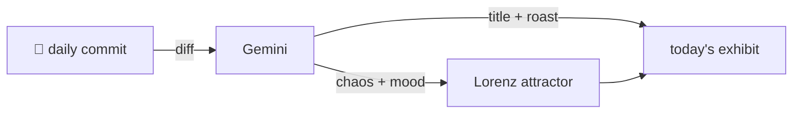

### Hey 👋

I'm Urav. I build things with code.

---

#### 📌 Featured Commit

Every day, a commit — mine, my network's, or a stranger's — gets named and roasted by an opinionated AI, then rendered as a unique strange attractor.

<!-- ENTROPY:START -->

### The Perennial Bump

Chaos █░░░░░░░░░ 15 · Mood $\color{#A0CBE8}{\blacksquare}$ #A0CBE8

[github/spec-kit](https://github.com/github/spec-kit) by [@mnriem](https://github.com/mnriem) · [`c47f334`](https://github.com/github/spec-kit/commit/c47f334629bed1394424bafb01e717abdf76b449)

~~~
chore: release 0.8.14, begin 0.8.15.dev0 development (#2706)

* chore: bump version to 0.8.14

* chore: begin 0.8.15.dev0 development

…
~~~

Another glorious cycle completes, with bots co-authoring the inevitable version bump and changelog update. This is a perfectly mechanical 'chore', proving that the wheels of progress, even the tiny ones, keep turning on schedule. The future date in the changelog entry is a delightful touch, ensuring *someone* is always thinking ahead.

captured 2026-05-26

<!-- ENTROPY:END -->

---

What is this?

 

A GitHub Action runs daily and picks a commit — mine → my network → a starred repo → a legendary fallback. Gemini names it, roasts it, and scores its **chaos** (0–100) and **mood** (a color). Those drive a [Lorenz attractor](https://en.wikipedia.org/wiki/Lorenz_system): chaos bends ρ (how wild the butterfly gets), mood tints the gradient, and the commit hash seeds the initial conditions — so deterministic chaos gives every commit its own strange attractor.

[See the code →](./entropy)

