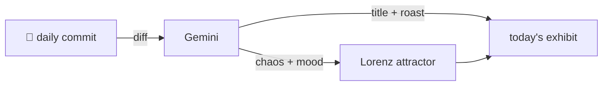

### Hey 👋

I'm Urav. I build things with code.

---

#### 📌 Featured Commit

Every day a bot grabs a commit (one of mine, someone I follow, or a stranger's), an AI names and roasts it, and it ends up as a strange attractor.

<!-- ENTROPY:START -->

### MLX Absenteeism

Chaos ███░░░░░░░ 35 · Mood $\color{#7E9FBB}{\blacksquare}$ #7E9FBB

[murtazahr/Kafila](https://github.com/murtazahr/Kafila) by [@murtazahr](https://github.com/murtazahr) · [`96b374b`](https://github.com/murtazahr/Kafila/commit/96b374b57e0466856825a5a5dee15cd84d083a4b)

~~~
agent: skip the batch tests when MLX is absent

Two tests build a batch, which allocates an array, and had no guard. Without the
runtime those calls resolve to null and the process dies with rip=0x0 rather
than failing a test -- so the package takes
…
~~~

Ah, the classic CI surprise: an invisible dependency silently crashing the test suite. This fix wisely adds a skip for absent runtimes, turning potential 'rip=0x0' disasters into civilized, guarded test executions. It's pragmatic code, even if co-authored by a large language model whose understanding of hardware is questionable at best.

captured 2026-08-24

<!-- ENTROPY:END -->

---

What is this?

 

A GitHub Action runs daily and picks a commit: mine if I've pushed recently, otherwise something from my network or a starred repo, and the Linux genesis commit as a last resort. Gemini gives it a name, a roast, a chaos score (0-100), and a mood color. Those become a [Lorenz attractor](https://en.wikipedia.org/wiki/Lorenz_system): chaos controls how wild the butterfly gets, mood tints the gradient, and the commit hash sets the starting point. The math is identical every run, so the commit is the only thing that changes the picture.

[See the code →](./entropy)

