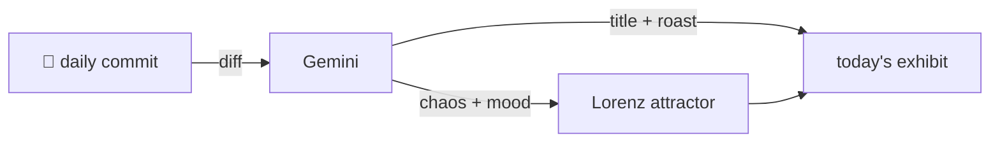

### Hey 👋

I'm Urav. I build things with code.

---

#### 📌 Featured Commit

Every day a bot grabs a commit (one of mine, someone I follow, or a stranger's), an AI names and roasts it, and it ends up as a strange attractor.

<!-- ENTROPY:START -->

### Dev Trait Disentanglement

Chaos ██████░░░░ 60 · Mood $\color{#4A90E2}{\blacksquare}$ #4A90E2

[palmier-io/palmier-pro](https://github.com/palmier-io/palmier-pro) by [@htin1](https://github.com/htin1) · [`8d5648d`](https://github.com/palmier-io/palmier-pro/commit/8d5648d893c3cd9b71677c5acea44c08b9616f7c)

~~~
[build] Make development traits opt in (#440)
~~~

Ah, the inevitable disentanglement of build configurations. Making heavyweight features like bundled speech and especially 'production telemetry' opt-in for dev builds is excellent for iteration speed and sanity. The build script is getting a bit chonky with all the new conditional logic, but this is a battle well-fought for developer ergonomics.

captured 2026-07-31

<!-- ENTROPY:END -->

---

What is this?

 

A GitHub Action runs daily and picks a commit: mine if I've pushed recently, otherwise something from my network or a starred repo, and the Linux genesis commit as a last resort. Gemini gives it a name, a roast, a chaos score (0-100), and a mood color. Those become a [Lorenz attractor](https://en.wikipedia.org/wiki/Lorenz_system): chaos controls how wild the butterfly gets, mood tints the gradient, and the commit hash sets the starting point. The math is identical every run, so the commit is the only thing that changes the picture.

[See the code →](./entropy)

