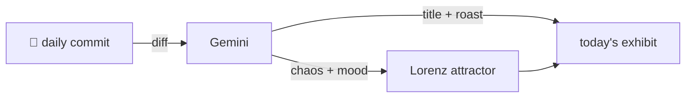

### Hey 👋

I'm Urav. I build things with code.

---

#### 📌 Featured Commit

Every day a bot grabs a commit (one of mine, someone I follow, or a stranger's), an AI names and roasts it, and it ends up as a strange attractor.

<!-- ENTROPY:START -->

### Trials of Decentralization

Chaos ███░░░░░░░ 35 · Mood $\color{#D4B84D}{\blacksquare}$ #D4B84D

[Cloudslab/murmura](https://github.com/Cloudslab/murmura) by [@Unknown](https://github.com/Unknown) · [`503ca62`](https://github.com/Cloudslab/murmura/commit/503ca62cd41d0b6aafbcbf16fee83054fc94c569)

~~~
Experiment 1 results
~~~

Just dumping raw experiment logs into the repository feels a bit… unsophisticated for artifact management. While logging results is essential, keeping such verbose output directly in Git means the commit history will quickly become bloated with ephemeral data rather than durable code. Plus, those accuracy numbers are just *sad*.

captured 2026-06-19

<!-- ENTROPY:END -->

---

What is this?

 

A GitHub Action runs daily and picks a commit: mine if I've pushed recently, otherwise something from my network or a starred repo, and the Linux genesis commit as a last resort. Gemini gives it a name, a roast, a chaos score (0-100), and a mood color. Those become a [Lorenz attractor](https://en.wikipedia.org/wiki/Lorenz_system): chaos controls how wild the butterfly gets, mood tints the gradient, and the commit hash sets the starting point. The math is identical every run, so the commit is the only thing that changes the picture.

[See the code →](./entropy)

