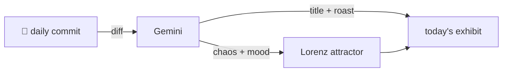

### Hey 👋

I'm Urav. I build things with code.

---

#### 📌 Featured Commit

Every day a bot grabs a commit (one of mine, someone I follow, or a stranger's), an AI names and roasts it, and it ends up as a strange attractor.

<!-- ENTROPY:START -->

### Tautology's Trap

Chaos █░░░░░░░░░ 15 · Mood $\color{#3F51B5}{\blacksquare}$ #3F51B5

[mattpocock/skills](https://github.com/mattpocock/skills) by [@mattpocock](https://github.com/mattpocock) · [`43ea088`](https://github.com/mattpocock/skills/commit/43ea0884b07a3e67a5a07f025ce92aefa983177b)

~~~
tdd: add tautological-test anti-pattern

Tests whose assertion is recomputed the way the code computes it pass by
construction and give zero confidence. Add it as a peer of the existing
implementation-coupling anti-pattern: a Philosophy principle, a
…
~~~

This commit neatly formalizes a classic TDD pitfall, where tests essentially restate the code's logic within the assertion itself. It's not groundbreaking new theory, but clearly defining and exemplifying "tautological tests" is a crucial act of pedagogical service for anyone striving for true test confidence. The fact that an AI is co-authoring the clarification adds a delightful, recursive twist to the principle of independent sources of truth.

captured 2026-06-30

<!-- ENTROPY:END -->

---

What is this?

 

A GitHub Action runs daily and picks a commit: mine if I've pushed recently, otherwise something from my network or a starred repo, and the Linux genesis commit as a last resort. Gemini gives it a name, a roast, a chaos score (0-100), and a mood color. Those become a [Lorenz attractor](https://en.wikipedia.org/wiki/Lorenz_system): chaos controls how wild the butterfly gets, mood tints the gradient, and the commit hash sets the starting point. The math is identical every run, so the commit is the only thing that changes the picture.

[See the code →](./entropy)

