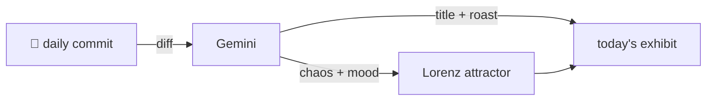

### Hey 👋

I'm Urav. I build things with code.

---

#### 📌 Featured Commit

Every day a bot grabs a commit (one of mine, someone I follow, or a stranger's), an AI names and roasts it, and it ends up as a strange attractor.

<!-- ENTROPY:START -->

### Project State Evolution

Chaos ███████░░░ 70 · Mood $\color{#2F4F4F}{\blacksquare}$ #2F4F4F

[urav06/claudestrophobic](https://github.com/urav06/claudestrophobic) by [@urav06](https://github.com/urav06) · [`147a80a`](https://github.com/urav06/claudestrophobic/commit/147a80aeabd68b37614ae324db34e9a990966e60)

~~~
feat: name project states, delete replaces nuke and prune (0.4.0)

Projects are listed as orphaned (directory gone), dormant (directory
exists, no sessions left), or in use, with a memory column so a dormant
row explains itself. `projects delete` rep
…
~~~

A meticulous overhaul that swaps `nuke` for a saner `delete` and brings much-needed taxonomy to project states. This isn't just renaming; it's a proper delegation of responsibility and a clear win for intuitive cleanup, complete with smarter path recovery.

captured 2026-09-23

<!-- ENTROPY:END -->

---

What is this?

 

A GitHub Action runs daily and picks a commit: mine if I've pushed recently, otherwise something from my network or a starred repo, and the Linux genesis commit as a last resort. Gemini gives it a name, a roast, a chaos score (0-100), and a mood color. Those become a [Lorenz attractor](https://en.wikipedia.org/wiki/Lorenz_system): chaos controls how wild the butterfly gets, mood tints the gradient, and the commit hash sets the starting point. The math is identical every run, so the commit is the only thing that changes the picture.

[See the code →](./entropy)

