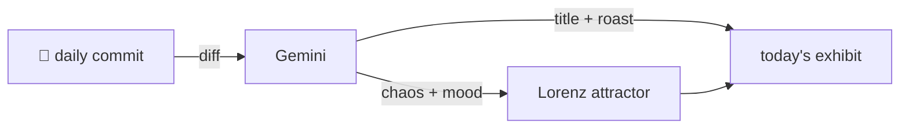

### Hey 👋

I'm Urav. I build things with code.

---

#### 📌 Featured Commit

Every day a bot grabs a commit (one of mine, someone I follow, or a stranger's), an AI names and roasts it, and it ends up as a strange attractor.

<!-- ENTROPY:START -->

### The Ring And Its Clocks

Chaos ███████░░░ 70 · Mood $\color{#4FC3F7}{\blacksquare}$ #4FC3F7

[murtazahr/Kafila](https://github.com/murtazahr/Kafila) by [@murtazahr](https://github.com/murtazahr) · [`f28db9f`](https://github.com/murtazahr/Kafila/commit/f28db9fbd99219d812556e630263fae445766d64)

~~~
docs: make the README about Kafila

The README was upstream's, so the repository introduced itself as Ollama and
then spent three hundred lines on download links and a community integrations
list, none of which says anything about what this fork is f
…
~~~

This isn't just a README rewrite; it's an intellectual refactoring of a project's identity. Swapping generic download links for a deeply technical discussion on distributed model inference and a principled approach to clock discipline elevates the documentation from user guide to research platform. The clarity on complex, easily fudged problems is genuinely impressive.

captured 2026-08-16

<!-- ENTROPY:END -->

---

What is this?

 

A GitHub Action runs daily and picks a commit: mine if I've pushed recently, otherwise something from my network or a starred repo, and the Linux genesis commit as a last resort. Gemini gives it a name, a roast, a chaos score (0-100), and a mood color. Those become a [Lorenz attractor](https://en.wikipedia.org/wiki/Lorenz_system): chaos controls how wild the butterfly gets, mood tints the gradient, and the commit hash sets the starting point. The math is identical every run, so the commit is the only thing that changes the picture.

[See the code →](./entropy)

