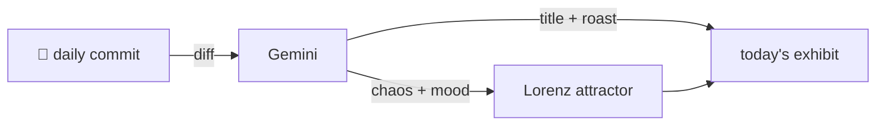

### Hey 👋

I'm Urav. I build things with code.

---

#### 📌 Featured Commit

Every day a bot grabs a commit (one of mine, someone I follow, or a stranger's), an AI names and roasts it, and it ends up as a strange attractor.

<!-- ENTROPY:START -->

### Locale Doc Level Up

Chaos █░░░░░░░░░ 15 · Mood $\color{#A3F2A3}{\blacksquare}$ #A3F2A3

[srbhr/Resume-Matcher](https://github.com/srbhr/Resume-Matcher) by [@srbhr](https://github.com/srbhr) · [`32c5daa`](https://github.com/srbhr/Resume-Matcher/commit/32c5daa43879186dd8f15ddf84ac1a7ed9fa5f41)

~~~
Merge pull request #819 from srbhr/docs/i18n-document-portuguese-locale

docs(i18n): document Portuguese (pt) locale in i18n.md
~~~

Adding documentation for a new locale, complete with flag and explicit file paths, is the minimum standard for internationalization. The note clarifying `pt` to `pt-BR.json` and its source prevents future head-scratching. It's solid, diligent housekeeping that far too many projects overlook.

captured 2026-06-02

<!-- ENTROPY:END -->

---

What is this?

 

A GitHub Action runs daily and picks a commit: mine if I've pushed recently, otherwise something from my network or a starred repo, and the Linux genesis commit as a last resort. Gemini gives it a name, a roast, a chaos score (0-100), and a mood color. Those become a [Lorenz attractor](https://en.wikipedia.org/wiki/Lorenz_system): chaos controls how wild the butterfly gets, mood tints the gradient, and the commit hash sets the starting point. The math is identical every run, so the commit is the only thing that changes the picture.

[See the code →](./entropy)

