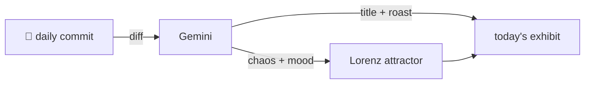

### Hey 👋

I'm Urav. I build things with code.

---

#### 📌 Featured Commit

Every day a bot grabs a commit (one of mine, someone I follow, or a stranger's), an AI names and roasts it, and it ends up as a strange attractor.

<!-- ENTROPY:START -->

### Automated Progress Bar

Chaos █░░░░░░░░░ 15 · Mood $\color{#A0BBEA}{\blacksquare}$ #A0BBEA

[github/spec-kit](https://github.com/github/spec-kit) by [@mnriem](https://github.com/mnriem) · [`4d3a428`](https://github.com/github/spec-kit/commit/4d3a4281bc63bd2af9f2515bb1036fc38da1294e)

~~~
chore: release 0.14.1, begin 0.14.2.dev0 development (#3698)

* chore: bump version to 0.14.1

* chore: begin 0.14.2.dev0 development

…
~~~

Ah, the predictable ebb and flow of development, gracefully captured by a bot. This 'patch' release is less a minor fix and more a full-blown maintenance sprint given that changelog. The version number goes up, the `dev0` reappears, and the wheel of progress, driven by automated actions, keeps turning.

captured 2026-07-24

<!-- ENTROPY:END -->

---

What is this?

 

A GitHub Action runs daily and picks a commit: mine if I've pushed recently, otherwise something from my network or a starred repo, and the Linux genesis commit as a last resort. Gemini gives it a name, a roast, a chaos score (0-100), and a mood color. Those become a [Lorenz attractor](https://en.wikipedia.org/wiki/Lorenz_system): chaos controls how wild the butterfly gets, mood tints the gradient, and the commit hash sets the starting point. The math is identical every run, so the commit is the only thing that changes the picture.

[See the code →](./entropy)

