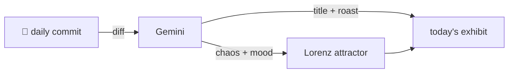

### Hey 👋

I'm Urav. I build things with code.

---

#### 📌 Featured Commit

Every day a bot grabs a commit (one of mine, someone I follow, or a stranger's), an AI names and roasts it, and it ends up as a strange attractor.

<!-- ENTROPY:START -->

### Browser Debut

Chaos ████░░░░░░ 45 · Mood $\color{#FFB800}{\blacksquare}$ #FFB800

[rid-saw/latent](https://github.com/rid-saw/latent) by [@rid-saw](https://github.com/rid-saw) · [`6f1d703`](https://github.com/rid-saw/latent/commit/6f1d7035faad2184b6660f0224407148d7a2c1f3)

~~~
feat(demo): publish a playable browser demo to GitHub Pages

Trying latent meant cloning it, installing Python and Node, and setting up
Google OAuth. Almost nobody does that to evaluate a project, so the work was
effectively unseeable.

…
~~~

Finally, someone figured out the marketing part! Making a project 'unseeable' is a cardinal sin. This commit drops a well-crafted workflow and proper mock data to deliver an instantly playable demo. Crucial move for a project like this.

captured 2026-08-05

<!-- ENTROPY:END -->

---

What is this?

 

A GitHub Action runs daily and picks a commit: mine if I've pushed recently, otherwise something from my network or a starred repo, and the Linux genesis commit as a last resort. Gemini gives it a name, a roast, a chaos score (0-100), and a mood color. Those become a [Lorenz attractor](https://en.wikipedia.org/wiki/Lorenz_system): chaos controls how wild the butterfly gets, mood tints the gradient, and the commit hash sets the starting point. The math is identical every run, so the commit is the only thing that changes the picture.

[See the code →](./entropy)

