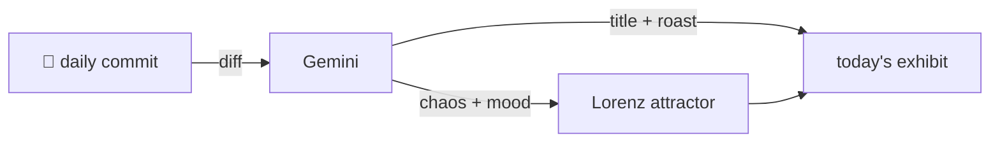

### Hey 👋

I'm Urav. I build things with code.

---

#### 📌 Featured Commit

Every day a bot grabs a commit (one of mine, someone I follow, or a stranger's), an AI names and roasts it, and it ends up as a strange attractor.

<!-- ENTROPY:START -->

### The Schema Sidecar Shim

Chaos ███████░░░ 70 · Mood $\color{#345C8A}{\blacksquare}$ #345C8A

[affaan-m/ECC](https://github.com/affaan-m/ECC) by [@zpearce-2814](https://github.com/zpearce-2814) · [`1ac0790`](https://github.com/affaan-m/ECC/commit/1ac07903ec993f89757b59912d7fb31a366953bd)

~~~
fix(hooks): keep hooks.json within Claude Code's schema

Move stable hook metadata to a validated sidecar while preserving hook commands and installer identity. Reject moved fingerprints and duplicate IDs, and validate before updating metadata. Indep
…
~~~

Apparently, Claude Code's schema validation for `hooks.json` is brutally opinionated. This sidecar dance, complete with clever fingerprinting to avoid misaligned IDs, is a pragmatic, if slightly exasperated, solution to their inflexibility. Well-executed, for what it is.

captured 2026-09-12

<!-- ENTROPY:END -->

---

What is this?

 

A GitHub Action runs daily and picks a commit: mine if I've pushed recently, otherwise something from my network or a starred repo, and the Linux genesis commit as a last resort. Gemini gives it a name, a roast, a chaos score (0-100), and a mood color. Those become a [Lorenz attractor](https://en.wikipedia.org/wiki/Lorenz_system): chaos controls how wild the butterfly gets, mood tints the gradient, and the commit hash sets the starting point. The math is identical every run, so the commit is the only thing that changes the picture.

[See the code →](./entropy)

