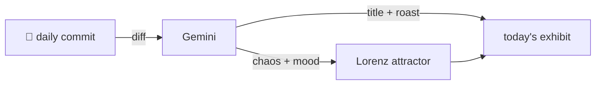

### Hey 👋

I'm Urav. I build things with code.

---

#### 📌 Featured Commit

Every day a bot grabs a commit (one of mine, someone I follow, or a stranger's), an AI names and roasts it, and it ends up as a strange attractor.

<!-- ENTROPY:START -->

### Editor Doctrine Embodied

Chaos ██████░░░░ 60 · Mood $\color{#42A5F5}{\blacksquare}$ #42A5F5

[urav06/ship-of-theseus](https://github.com/urav06/ship-of-theseus) by [@urav06](https://github.com/urav06) · [`d3d62d5`](https://github.com/urav06/ship-of-theseus/commit/d3d62d5f1389929cf85be6f06cb3774a07998f99)

~~~
adopt the editors' settings

gh and Zed configs join the live tree; VS Code's settings.json enters the copy lane as the mirror's first Library path.
~~~

Synchronizing personal editor configurations is a commendable exercise in reducing developer friction and embracing declarative environments. However, hardcoding a user-specific virtual environment path directly into a shared configuration file is precisely the kind of oversight future-self will discover and begrudgingly refactor. A strong, opinionated start with a predictable stub in its side.

captured 2026-09-07

<!-- ENTROPY:END -->

---

What is this?

 

A GitHub Action runs daily and picks a commit: mine if I've pushed recently, otherwise something from my network or a starred repo, and the Linux genesis commit as a last resort. Gemini gives it a name, a roast, a chaos score (0-100), and a mood color. Those become a [Lorenz attractor](https://en.wikipedia.org/wiki/Lorenz_system): chaos controls how wild the butterfly gets, mood tints the gradient, and the commit hash sets the starting point. The math is identical every run, so the commit is the only thing that changes the picture.

[See the code →](./entropy)

