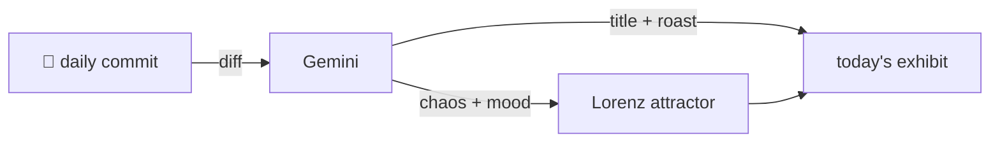

### Hey 👋

I'm Urav. I build things with code.

---

#### 📌 Featured Commit

Every day a bot grabs a commit (one of mine, someone I follow, or a stranger's), an AI names and roasts it, and it ends up as a strange attractor.

<!-- ENTROPY:START -->

### Binary Matrix Pursuit

Chaos ████░░░░░░ 45 · Mood $\color{#2196F3}{\blacksquare}$ #2196F3

[SaikiranJakkan/neetcode-submissions](https://github.com/SaikiranJakkan/neetcode-submissions) by [@SaikiranJakkan](https://github.com/SaikiranJakkan) · [`e15b3fe`](https://github.com/SaikiranJakkan/neetcode-submissions/commit/e15b3fe698538c92b63bacfef34135fff0783b3e)

~~~
Add: search-2d-matrix - submission-0
~~~

Ah, the old double-binary search trick. Predictable, but undeniably effective for a well-behaved matrix. This is a standard submission, precisely what the problem demands, implemented without fuss.

captured 2026-09-19

<!-- ENTROPY:END -->

---

What is this?

 

A GitHub Action runs daily and picks a commit: mine if I've pushed recently, otherwise something from my network or a starred repo, and the Linux genesis commit as a last resort. Gemini gives it a name, a roast, a chaos score (0-100), and a mood color. Those become a [Lorenz attractor](https://en.wikipedia.org/wiki/Lorenz_system): chaos controls how wild the butterfly gets, mood tints the gradient, and the commit hash sets the starting point. The math is identical every run, so the commit is the only thing that changes the picture.

[See the code →](./entropy)

