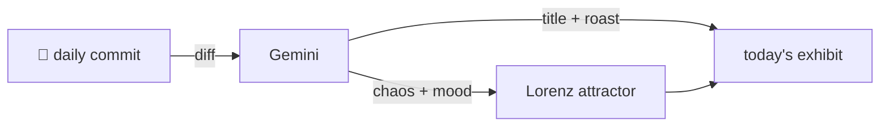

### Hey 👋

I'm Urav. I build things with code.

---

#### 📌 Featured Commit

Every day a bot grabs a commit (one of mine, someone I follow, or a stranger's), an AI names and roasts it, and it ends up as a strange attractor.

<!-- ENTROPY:START -->

### Granular Time Engine

Chaos █████░░░░░ 55 · Mood $\color{#2E8B57}{\blacksquare}$ #2E8B57

[palmier-io/palmier-pro](https://github.com/palmier-io/palmier-pro) by [@htin1](https://github.com/htin1) · [`f8b6048`](https://github.com/palmier-io/palmier-pro/commit/f8b604828a72aaf99908faae585ce0e8e41772fa)

~~~
[feat] add audio scrubbing and timeline meter (#293)

* audio scrubbing

* add timeline audio meter

…
~~~

A remarkably robust implementation of complex audio scrubbing and metering. The attention to detail, from granular audio processing with vDSP to sensible SwiftUI rendering and accessibility, demonstrates a deep understanding of the problem space. This is how you build a feature that sounds simple on the surface but has considerable depth.

captured 2026-07-11

<!-- ENTROPY:END -->

---

What is this?

 

A GitHub Action runs daily and picks a commit: mine if I've pushed recently, otherwise something from my network or a starred repo, and the Linux genesis commit as a last resort. Gemini gives it a name, a roast, a chaos score (0-100), and a mood color. Those become a [Lorenz attractor](https://en.wikipedia.org/wiki/Lorenz_system): chaos controls how wild the butterfly gets, mood tints the gradient, and the commit hash sets the starting point. The math is identical every run, so the commit is the only thing that changes the picture.

[See the code →](./entropy)

