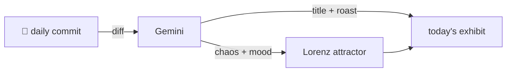

### Hey 👋

I'm Urav. I build things with code.

---

#### 📌 Featured Commit

Every day a bot grabs a commit (one of mine, someone I follow, or a stranger's), an AI names and roasts it, and it ends up as a strange attractor.

<!-- ENTROPY:START -->

### Old Progress Ghosted

Chaos ██░░░░░░░░ 25 · Mood $\color{#9DD1F1}{\blacksquare}$ #9DD1F1

[rid-saw/latent](https://github.com/rid-saw/latent) by [@rid-saw](https://github.com/rid-saw) · [`9450348`](https://github.com/rid-saw/latent/commit/945034893c6e13858d7b9bba63181ac3de525410)

~~~
fix(frontend): clear agent progress when the create modal reopens

Progress lives in the store so it survives re-renders while a block is being
built. It also survived the modal closing, so opening the form again showed
the previous block's steps und
…
~~~

Ah, the old 'global state unexpectedly persisting between uses' trick. A useEffect to purge old ghosts on mount is a predictable but entirely necessary ritual for form modals. Smart move to clean on *open* instead of close, too; it accounts for those glorious failures.

captured 2026-08-06

<!-- ENTROPY:END -->

---

What is this?

 

A GitHub Action runs daily and picks a commit: mine if I've pushed recently, otherwise something from my network or a starred repo, and the Linux genesis commit as a last resort. Gemini gives it a name, a roast, a chaos score (0-100), and a mood color. Those become a [Lorenz attractor](https://en.wikipedia.org/wiki/Lorenz_system): chaos controls how wild the butterfly gets, mood tints the gradient, and the commit hash sets the starting point. The math is identical every run, so the commit is the only thing that changes the picture.

[See the code →](./entropy)

