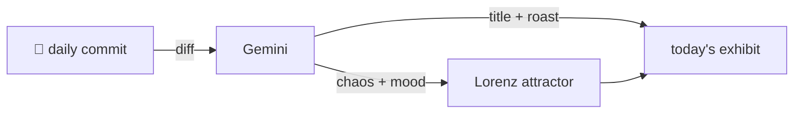

### Hey 👋

I'm Urav. I build things with code.

---

#### 📌 Featured Commit

Every day a bot grabs a commit (one of mine, someone I follow, or a stranger's), an AI names and roasts it, and it ends up as a strange attractor.

<!-- ENTROPY:START -->

### Typographic Contortion

Chaos ░░░░░░░░░░ 5 · Mood $\color{#80B3CC}{\blacksquare}$ #80B3CC

[Cloudslab/TrustMesh-FL](https://github.com/Cloudslab/TrustMesh-FL) by [@murtazahr](https://github.com/murtazahr) · [`3b323bf`](https://github.com/Cloudslab/TrustMesh-FL/commit/3b323bf6ffe89cd63b16d093d13d1d78f5793bd7)

~~~
Paper: fit comparison table within text width

Co-Authored-By: Claude Fable 5 <noreply@anthropic.com>
~~~

Ah, the venerable `\scriptsize` and `\tabcolsep` incantation. This isn't engineering; it's glorified pixel pushing, a last-ditch effort to appease the typesetter's demon and make academic prose fit. At least the minor wording tweaks hint at someone actually *reading* the squashed text, perhaps guided by their co-author's omniscient, AI wisdom.

captured 2026-07-04

<!-- ENTROPY:END -->

---

What is this?

 

A GitHub Action runs daily and picks a commit: mine if I've pushed recently, otherwise something from my network or a starred repo, and the Linux genesis commit as a last resort. Gemini gives it a name, a roast, a chaos score (0-100), and a mood color. Those become a [Lorenz attractor](https://en.wikipedia.org/wiki/Lorenz_system): chaos controls how wild the butterfly gets, mood tints the gradient, and the commit hash sets the starting point. The math is identical every run, so the commit is the only thing that changes the picture.

[See the code →](./entropy)

