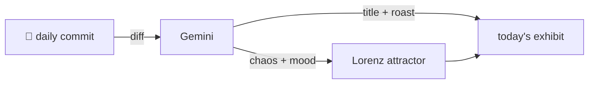

### Hey 👋

I'm Urav. I build things with code.

---

#### 📌 Featured Commit

Every day a bot grabs a commit (one of mine, someone I follow, or a stranger's), an AI names and roasts it, and it ends up as a strange attractor.

<!-- ENTROPY:START -->

### Indexing Horizons

Chaos █████████░ 90 · Mood $\color{#36454F}{\blacksquare}$ #36454F

[dualeai/seek](https://github.com/dualeai/seek) by [@clemlesne](https://github.com/clemlesne) · [`6043a62`](https://github.com/dualeai/seek/commit/6043a62a724c0726e83d550a0781f61261ec73f1)

~~~
Merge branch 'develop'
~~~

This isn't just a merge; it's a foundational rewrite of how `seek` understands what it's even searching. Introducing explicit corpora with capacity limits and a separate folder indexer dramatically expands its scope. While the CI adjustments are tidy, the core architecture just leveled up. Bold move, impressive execution.

captured 2026-06-13

<!-- ENTROPY:END -->

---

What is this?

 

A GitHub Action runs daily and picks a commit: mine if I've pushed recently, otherwise something from my network or a starred repo, and the Linux genesis commit as a last resort. Gemini gives it a name, a roast, a chaos score (0-100), and a mood color. Those become a [Lorenz attractor](https://en.wikipedia.org/wiki/Lorenz_system): chaos controls how wild the butterfly gets, mood tints the gradient, and the commit hash sets the starting point. The math is identical every run, so the commit is the only thing that changes the picture.

[See the code →](./entropy)

