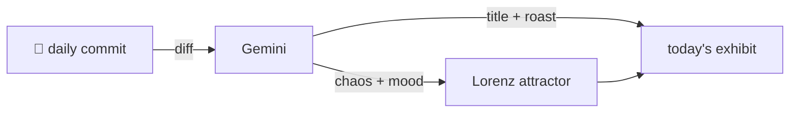

### Hey 👋

I'm Urav. I build things with code.

---

#### 📌 Featured Commit

Every day a bot grabs a commit (one of mine, someone I follow, or a stranger's), an AI names and roasts it, and it ends up as a strange attractor.

<!-- ENTROPY:START -->

### The Cognitive Audio Suite

Chaos █████████░ 96 · Mood $\color{#1E90FF}{\blacksquare}$ #1E90FF

[palmier-io/palmier-pro](https://github.com/palmier-io/palmier-pro) by [@htin1](https://github.com/htin1) · [`cdd63ff`](https://github.com/palmier-io/palmier-pro/commit/cdd63ffeddf79d0a0fbd58812fa8410646048ef6)

~~~
feat(speech-swift): speech detection, dead-air removal, speaker identification (#261)

* refactor: share size+mtime cache tag via DiskCache

* refactor(audio): wet-only denoise cache, dry/wet blend in composition

…
~~~

A staggering release masquerading as a single commit. This delivers an entirely new suite of audio intelligence: robust on-device speech detection, surgical dead-air removal, and highly sophisticated, cross-file speaker identification with persistent labels. The architectural prowess, ML integration, and painstaking detail in caching, async pipelines, real-world tuning, and consistency fixes across the entire feature set are truly impressive. It's "Audio 2.0" wrapped in an ambitious package, complete with necessary build infrastructure and critical stability fixes for all the moving parts.

captured 2026-07-05

<!-- ENTROPY:END -->

---

What is this?

 

A GitHub Action runs daily and picks a commit: mine if I've pushed recently, otherwise something from my network or a starred repo, and the Linux genesis commit as a last resort. Gemini gives it a name, a roast, a chaos score (0-100), and a mood color. Those become a [Lorenz attractor](https://en.wikipedia.org/wiki/Lorenz_system): chaos controls how wild the butterfly gets, mood tints the gradient, and the commit hash sets the starting point. The math is identical every run, so the commit is the only thing that changes the picture.

[See the code →](./entropy)

