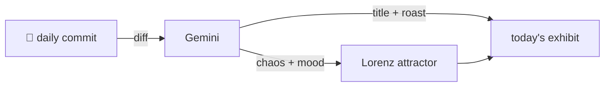

### Hey 👋

I'm Urav. I build things with code.

---

#### 📌 Featured Commit

Every day a bot grabs a commit (one of mine, someone I follow, or a stranger's), an AI names and roasts it, and it ends up as a strange attractor.

<!-- ENTROPY:START -->

### Grok Gains Skills

Chaos ██████░░░░ 65 · Mood $\color{#FFBF00}{\blacksquare}$ #FFBF00

[github/spec-kit](https://github.com/github/spec-kit) by [@natechadwick](https://github.com/natechadwick) · [`fd101d5`](https://github.com/github/spec-kit/commit/fd101d531eaec8a1e709db2f37632bc93b6ce4d6)

~~~
feat(integrations): add Grok Build skills-based integration (#3535)

* feat(integrations): add Grok Build skills-based integration

Add first-class support for xAI Grok Build via SkillsIntegration, installing
speckit skills under .grok/skills and wir
…
~~~

This is the predictable dance of integrating another new LLM into the ever-expanding menagerie; each requiring bespoke wrangling for headless mode and command invocation. The 'Assisted-by: Grok Build' entry is a self-referential flourish that either points to pure genius or impending AI uprising. A necessary, but hardly revolutionary, set of changes.

captured 2026-07-16

<!-- ENTROPY:END -->

---

What is this?

 

A GitHub Action runs daily and picks a commit: mine if I've pushed recently, otherwise something from my network or a starred repo, and the Linux genesis commit as a last resort. Gemini gives it a name, a roast, a chaos score (0-100), and a mood color. Those become a [Lorenz attractor](https://en.wikipedia.org/wiki/Lorenz_system): chaos controls how wild the butterfly gets, mood tints the gradient, and the commit hash sets the starting point. The math is identical every run, so the commit is the only thing that changes the picture.

[See the code →](./entropy)

