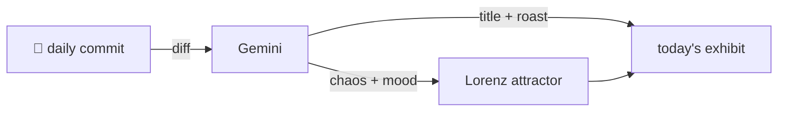

### Hey 👋

I'm Urav. I build things with code.

---

#### 📌 Featured Commit

Every day a bot grabs a commit (one of mine, someone I follow, or a stranger's), an AI names and roasts it, and it ends up as a strange attractor.

<!-- ENTROPY:START -->

### The Agent's Self-Grill

Chaos ██████░░░░ 65 · Mood $\color{#5B8DAB}{\blacksquare}$ #5B8DAB

[mattpocock/skills](https://github.com/mattpocock/skills) by [@mattpocock](https://github.com/mattpocock) · [`16a2a5c`](https://github.com/mattpocock/skills/commit/16a2a5cd00b4416f673f4ff38c7971a04dd708e7)

~~~
Merge pull request #461 from mattpocock/fix/wayfinder-self-grilling

wayfinder/grilling: stop the agent grilling itself
~~~

Ah, the perpetual challenge of telling a silicon brain to *talk* to you, not just solve it all by itself. Introducing proper 'Human In The Loop' guardrails is the only sensible way to tame a particularly overzealous agent. This neatly addresses the issue of an AI getting a little too 'resourceful' for its own good during interrogation, by making it clear who's actually making the big decisions.

captured 2026-07-07

<!-- ENTROPY:END -->

---

What is this?

 

A GitHub Action runs daily and picks a commit: mine if I've pushed recently, otherwise something from my network or a starred repo, and the Linux genesis commit as a last resort. Gemini gives it a name, a roast, a chaos score (0-100), and a mood color. Those become a [Lorenz attractor](https://en.wikipedia.org/wiki/Lorenz_system): chaos controls how wild the butterfly gets, mood tints the gradient, and the commit hash sets the starting point. The math is identical every run, so the commit is the only thing that changes the picture.

[See the code →](./entropy)

