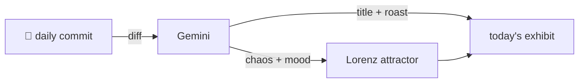

### Hey 👋

I'm Urav. I build things with code.

---

#### 📌 Featured Commit

Every day, a commit — mine, my network's, or a stranger's — gets named and roasted by an opinionated AI, then rendered as a unique strange attractor.

<!-- ENTROPY:START -->

Last updated: 2026-05-26

**Commit:** [affaan-m/ECC](https://github.com/affaan-m/ECC) by [@affaan-m](https://github.com/affaan-m) · [`928076c`](https://github.com/affaan-m/ECC/commit/928076cc08cbb31e8549cea2883b4f51811de1c8)

**Message:**

~~~
chore: export marketing campaign command
~~~

---

**Review:** Exporting a 'marketing campaign command' as a mere 'chore'? The priorities of this 'agent' are crystal clear now, and it's less Skynet, more SalesNet. A one-line addition, yet its existential implications for sentient AI are profound.

`Chaos: 5%` · `Mood: #B0C4DE`

<!-- ENTROPY:END -->

---

What is this?

 

A GitHub Action runs daily and picks a commit — mine → my network → a starred repo → a legendary fallback. Gemini names it, roasts it, and scores its **chaos** (0–100) and **mood** (a color). Those drive a [Lorenz attractor](https://en.wikipedia.org/wiki/Lorenz_system): chaos bends ρ (how wild the butterfly gets), mood tints the gradient, and the commit hash seeds the initial conditions — so deterministic chaos gives every commit its own strange attractor.

[See the code →](./entropy)

