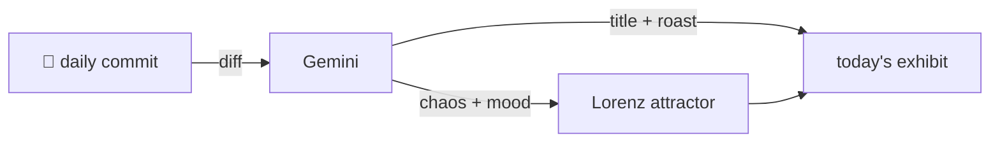

### Hey 👋

I'm Urav. I build things with code.

---

#### 📌 Featured Commit

Every day a bot grabs a commit (one of mine, someone I follow, or a stranger's), an AI names and roasts it, and it ends up as a strange attractor.

<!-- ENTROPY:START -->

### The Machine's Handshake

Chaos █░░░░░░░░░ 15 · Mood $\color{#4682B4}{\blacksquare}$ #4682B4

[rid-saw/flash-cards-4-fun](https://github.com/rid-saw/flash-cards-4-fun) by [@rid-saw](https://github.com/rid-saw) · [`ed8b23c`](https://github.com/rid-saw/flash-cards-4-fun/commit/ed8b23c454158039a9747153e2071e28c1563e9b)

~~~
Update uv.lock for jinja2 dependency

Co-Authored-By: Claude Opus 4.7 <noreply@anthropic.com>
~~~

Another uv.lock file expands, integrating jinja2 and its required markupsafe. The most intriguing aspect isn't the new templating engine, but the clear sign that even basic dependency management now warrants an AI co-pilot. Is this peak efficiency, or just outsourcing the most trivial `uv` commands?

captured 2026-06-22

<!-- ENTROPY:END -->

---

What is this?

 

A GitHub Action runs daily and picks a commit: mine if I've pushed recently, otherwise something from my network or a starred repo, and the Linux genesis commit as a last resort. Gemini gives it a name, a roast, a chaos score (0-100), and a mood color. Those become a [Lorenz attractor](https://en.wikipedia.org/wiki/Lorenz_system): chaos controls how wild the butterfly gets, mood tints the gradient, and the commit hash sets the starting point. The math is identical every run, so the commit is the only thing that changes the picture.

[See the code →](./entropy)

