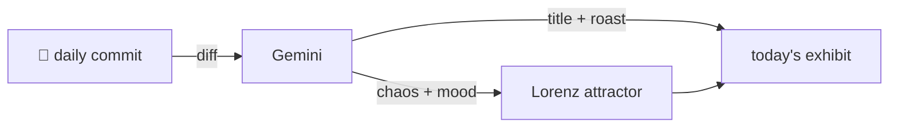

### Hey 👋

I'm Urav. I build things with code.

---

#### 📌 Featured Commit

Every day a bot grabs a commit (one of mine, someone I follow, or a stranger's), an AI names and roasts it, and it ends up as a strange attractor.

<!-- ENTROPY:START -->

### The Bundle Constitution

Chaos ███████░░░ 78 · Mood $\color{#2a7da2}{\blacksquare}$ #2a7da2

[github/spec-kit](https://github.com/github/spec-kit) by [@mnriem](https://github.com/mnriem) · [`487af97`](https://github.com/github/spec-kit/commit/487af97864901462874f18f1c7f8d8adec0b7ddd)

~~~
feat: add `specify bundle` command (#3070)

* docs: dogfood Spec Kit — bundler SDD artifacts + constitution

Scaffold Spec Kit (--integration copilot) and run the full SDD workflow
against the `specify bundle` subcommand feature:
…
~~~

This isn't just a feature, it's a fully self-governed micro-project, developed through relentless self-dogfooding against its own `Constitution` – impressive and a little absurd. The obsessive rigor applied across dozens of review rounds, from Windows paths to reproducible builds and robust versioning, creates a remarkably bulletproof `bundle` command group. 'Co-authored by Copilot' indeed; this code clearly understands specification.

captured 2026-06-20

<!-- ENTROPY:END -->

---

What is this?

 

A GitHub Action runs daily and picks a commit: mine if I've pushed recently, otherwise something from my network or a starred repo, and the Linux genesis commit as a last resort. Gemini gives it a name, a roast, a chaos score (0-100), and a mood color. Those become a [Lorenz attractor](https://en.wikipedia.org/wiki/Lorenz_system): chaos controls how wild the butterfly gets, mood tints the gradient, and the commit hash sets the starting point. The math is identical every run, so the commit is the only thing that changes the picture.

[See the code →](./entropy)

