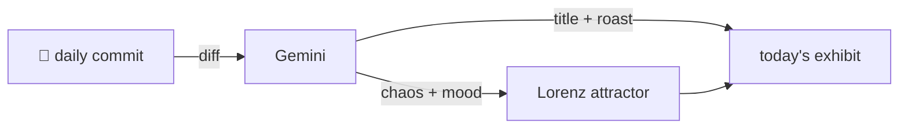

### Hey 👋

I'm Urav. I build things with code.

---

#### 📌 Featured Commit

Every day a bot grabs a commit (one of mine, someone I follow, or a stranger's), an AI names and roasts it, and it ends up as a strange attractor.

<!-- ENTROPY:START -->

### Docker's Lean Standard

Chaos ███░░░░░░░ 35 · Mood $\color{#4A7C8E}{\blacksquare}$ #4A7C8E

[urav06/ship-of-theseus](https://github.com/urav06/ship-of-theseus) by [@urav06](https://github.com/urav06) · [`988220b`](https://github.com/urav06/ship-of-theseus/commit/988220b3962916fc745211e83c6fe9e7c7ea08a1)

~~~
adopt the docker desktop settings store
~~~

Ah, the ever-popular external app configuration under source control. It's a clean move, especially since the `.gitignore` note explicitly calls out the app tidies the file; no more trivial diff noise! Declaring Docker Desktop's true, lean nature, free from AI and excessive cloud fluff, is a refreshing stance in an increasingly bloated ecosystem.

captured 2026-09-18

<!-- ENTROPY:END -->

---

What is this?

 

A GitHub Action runs daily and picks a commit: mine if I've pushed recently, otherwise something from my network or a starred repo, and the Linux genesis commit as a last resort. Gemini gives it a name, a roast, a chaos score (0-100), and a mood color. Those become a [Lorenz attractor](https://en.wikipedia.org/wiki/Lorenz_system): chaos controls how wild the butterfly gets, mood tints the gradient, and the commit hash sets the starting point. The math is identical every run, so the commit is the only thing that changes the picture.

[See the code →](./entropy)

