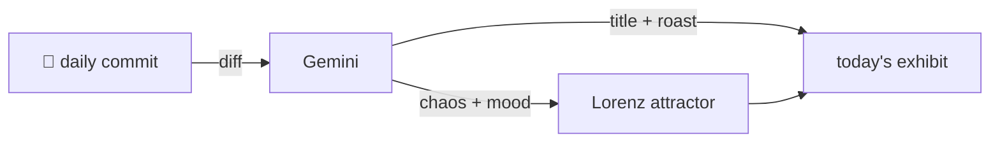

### Hey 👋

I'm Urav. I build things with code.

---

#### 📌 Featured Commit

Every day a bot grabs a commit (one of mine, someone I follow, or a stranger's), an AI names and roasts it, and it ends up as a strange attractor.

<!-- ENTROPY:START -->

### Infini-Boolean Defense

Chaos █████░░░░░ 55 · Mood $\color{#0077B6}{\blacksquare}$ #0077B6

[github/spec-kit](https://github.com/github/spec-kit) by [@jawwad-ali](https://github.com/jawwad-ali) · [`57cc518`](https://github.com/github/spec-kit/commit/57cc518d63d6f10da3dd93df1ebcadda87c59374)

~~~
fix(workflows): reject bool / .inf catalog priority in workflow & step catalog loaders (#3526)

* fix(workflows): reject bool/.inf catalog priority in workflow & step catalog loaders

The WorkflowRegistry and StepRegistry catalog-config loaders coerc
…
~~~

Python's `int()` method continues its reign of 'convenience' with implicit type coercion that invariably bites developers. This fix diligently guards against `bool` masquerading as `int` and the crash-inducing `float('inf')` from wrecking catalog priorities. A robust, albeit sadly necessary, defensive programming win.

captured 2026-07-21

<!-- ENTROPY:END -->

---

What is this?

 

A GitHub Action runs daily and picks a commit: mine if I've pushed recently, otherwise something from my network or a starred repo, and the Linux genesis commit as a last resort. Gemini gives it a name, a roast, a chaos score (0-100), and a mood color. Those become a [Lorenz attractor](https://en.wikipedia.org/wiki/Lorenz_system): chaos controls how wild the butterfly gets, mood tints the gradient, and the commit hash sets the starting point. The math is identical every run, so the commit is the only thing that changes the picture.

[See the code →](./entropy)

