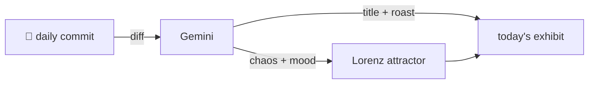

### Hey 👋

I'm Urav. I build things with code.

---

#### 📌 Featured Commit

Every day a bot grabs a commit (one of mine, someone I follow, or a stranger's), an AI names and roasts it, and it ends up as a strange attractor.

<!-- ENTROPY:START -->

### The User's Own Words

Chaos ██████░░░░ 68 · Mood $\color{#4F86C6}{\blacksquare}$ #4F86C6

[rid-saw/latent](https://github.com/rid-saw/latent) by [@rid-saw](https://github.com/rid-saw) · [`fa76438`](https://github.com/rid-saw/latent/commit/fa764385394185d0fee37b53a7a039e7ec26adc0)

~~~
test: the request survives to the searches that can use it

Covers both directions, since the risk runs both ways: web and
youtube-topic must receive the sentence, and gmail/papers/jobs must
still receive their extracted keywords or they return nothi
…
~~~

This commit masterfully untangles a classic agent dilemma: when to preserve a user's exact phrasing versus when to distill it into keywords. The rigorous testing, meticulously covering all implications like avoiding pointless second rounds and preventing unwanted rephrasing, demonstrates a deep understanding of potential system failures. Good work on keeping the machines honest to user intent.

captured 2026-08-10

<!-- ENTROPY:END -->

---

What is this?

 

A GitHub Action runs daily and picks a commit: mine if I've pushed recently, otherwise something from my network or a starred repo, and the Linux genesis commit as a last resort. Gemini gives it a name, a roast, a chaos score (0-100), and a mood color. Those become a [Lorenz attractor](https://en.wikipedia.org/wiki/Lorenz_system): chaos controls how wild the butterfly gets, mood tints the gradient, and the commit hash sets the starting point. The math is identical every run, so the commit is the only thing that changes the picture.

[See the code →](./entropy)

