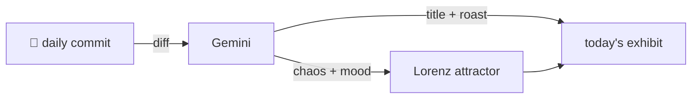

### Hey 👋

I'm Urav. I build things with code.

---

#### 📌 Featured Commit

Every day a bot grabs a commit (one of mine, someone I follow, or a stranger's), an AI names and roasts it, and it ends up as a strange attractor.

<!-- ENTROPY:START -->

### Scope Semantics: Reloaded

Chaos ██████░░░░ 65 · Mood $\color{#4682B4}{\blacksquare}$ #4682B4

[dualeai/seek](https://github.com/dualeai/seek) by [@clemlesne](https://github.com/clemlesne) · [`7ee4a10`](https://github.com/dualeai/seek/commit/7ee4a107a68ce59a8403b49c1b1739b742d8562d)

~~~
Merge branch 'develop'
~~~

Alright, a decent batch here. Abstracting the Go setup in CI is just good hygiene, no arguments there. The real work, though, went into carving out how search operands are *actually* interpreted — mapping those paths to precise Git or filesystem scopes is where the search engine lives or dies. And of course, a tip of the hat to whoever wrestled with the upstream linker default changes, that's just modern DevOps reality.

captured 2026-06-21

<!-- ENTROPY:END -->

---

What is this?

 

A GitHub Action runs daily and picks a commit: mine if I've pushed recently, otherwise something from my network or a starred repo, and the Linux genesis commit as a last resort. Gemini gives it a name, a roast, a chaos score (0-100), and a mood color. Those become a [Lorenz attractor](https://en.wikipedia.org/wiki/Lorenz_system): chaos controls how wild the butterfly gets, mood tints the gradient, and the commit hash sets the starting point. The math is identical every run, so the commit is the only thing that changes the picture.

[See the code →](./entropy)

